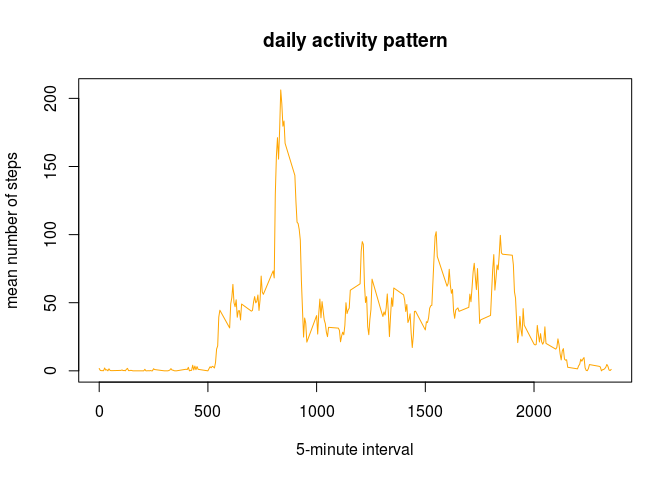

Written on Apr 29, 2018

## Loading and preprocessing the data

```r
fn<-"activity.csv"
if (!file.exists(fn)) {
  unzip("activity.zip")
}
f<-read.csv(fn)
f$dateD<-as.Date(as.character(f$date),"%Y-%m-%d")
```

## What is mean total number of steps taken per day?

```r
library("dplyr")
```

```
## 
## Attaching package: 'dplyr'
```

```
## The following objects are masked from 'package:stats':
## 
##     filter, lag
```

```
## The following objects are masked from 'package:base':
## 
##     intersect, setdiff, setequal, union
```

```r
days<-group_by(f,dateD)
spd<-summarize(days, m=mean(steps))
hist(spd$m,col="yellow",xlab="daily mean",
     main="Histogram - steps per day")
```

<!-- -->

```r
mea<-mean(spd$m,na.rm=T)
med<-median(spd$m,na.rm=T)
```
The mean and median of the total number of steps taken per day are, respectively, 37.3825996 and 37.3784722.

## What is the average daily activity pattern?

```r
library("dplyr")
is<-group_by(f,interval)
spi<-summarize(is, m=mean(steps,na.rm=T))
plot(spi$interval,spi$m,
     type="l",col="orange",xlab="5-minute interval",
     ylab="mean number of steps",main="daily activity pattern")
```

<!-- -->

```r
max<-which.max(spi$m)
```
On average across all the days in the dataset, the 835-th 5-minute interval contains the maximum number of steps.

## Imputing missing values

```r
# find total number of NAs
NAs <- is.na(f$steps)
numNA <- sum(is.na(f$steps))
```

The total number of missing values in the dataset equals 2304. If the NAs were to be replaced by the mean for that 5-minute interval, this is the new histogram of the total number of steps taken each day. Compare it with the first graph plotted above.


```r
## find mean number of steps per interval
#s<-split(f,f$interval)
#mInt<-sapply(s,function(x) {mean(x[,1],na.rm=T) })
#that didn't work because it generates a list :(

## trying again this time using melt/dcast
library("reshape2")
# create new column, "mean", with the mean of steps per interval
fm<-melt(f,id=c("interval","date"),measure.vars=c("steps"))
mStep<-dcast(fm,interval~variable,mean,na.rm=T)
names(mStep)<-c("interval","mean")
# add new column to database f, creating a new dataset
fs<-merge(f,mStep,id="interval")
# replace NAs with the new column, "mean"
bool<-which(is.na(fs$steps))
fs$steps[bool]<-fs$mean[bool]
# generate histogram
days<-group_by(fs,dateD)
spd<-summarize(days, m=mean(steps))
hist(spd$m,col="red",xlab="daily mean",
     main="Histogram - steps per day",
     sub="NAs replaced by interval mean")
```

<!-- -->

```r
mea<-mean(spd$m,na.rm=T)
med<-median(spd$m,na.rm=T)
```
The new mean of the total number of steps taken per day is now 37.3825996 and the new median is 37.3825996. As can be seen, the strategy of replacing the NAs didn't significantly modify the shape of the histogram. The mean remained the same and the median slightly changed, but still not that much.

## Are there differences in activity patterns between weekdays and weekends?

```r
# create a variable, day, that tells whether the day is a weekday
library(lubridate)
```

```
## 
## Attaching package: 'lubridate'
```

```
## The following object is masked from 'package:base':
## 
##     date
```

```r
fs$day<-weekdays(fs$dateD)
bool<-which(fs$day %in% c("Saturday","Sunday"))
fs$day[bool]<-"weekend"
bool<-which(fs$day %in% c("Monday","Tuesday","Wednesday",
                          "Thursday","Friday"))
fs$day[bool]<-"weekday"
# separate both sets
wy<-subset(fs,fs$day=="weekday")
wd<-subset(fs,fs$day=="weekend")
# find the average number of steps for each set
iswy<-group_by(wy,interval)
spiwy<-summarize(iswy, m=mean(steps,na.rm=T))
iswd<-group_by(wd,interval)
spiwd<-summarize(iswd, m=mean(steps,na.rm=T))
spiwy$day<-"weekday"
spiwd$day<-"weekend"
# rejoin both sets
spi<-rbind(spiwd,spiwy)
spi<-transform(spi,day=factor(day))
# plot both graphics
library(lattice)
xyplot(spi$m ~ spi$interval | spi$day,
     layout=c(1,2),type="l",
     xlab="Interval",ylab="Number of steps")
```

<!-- -->
